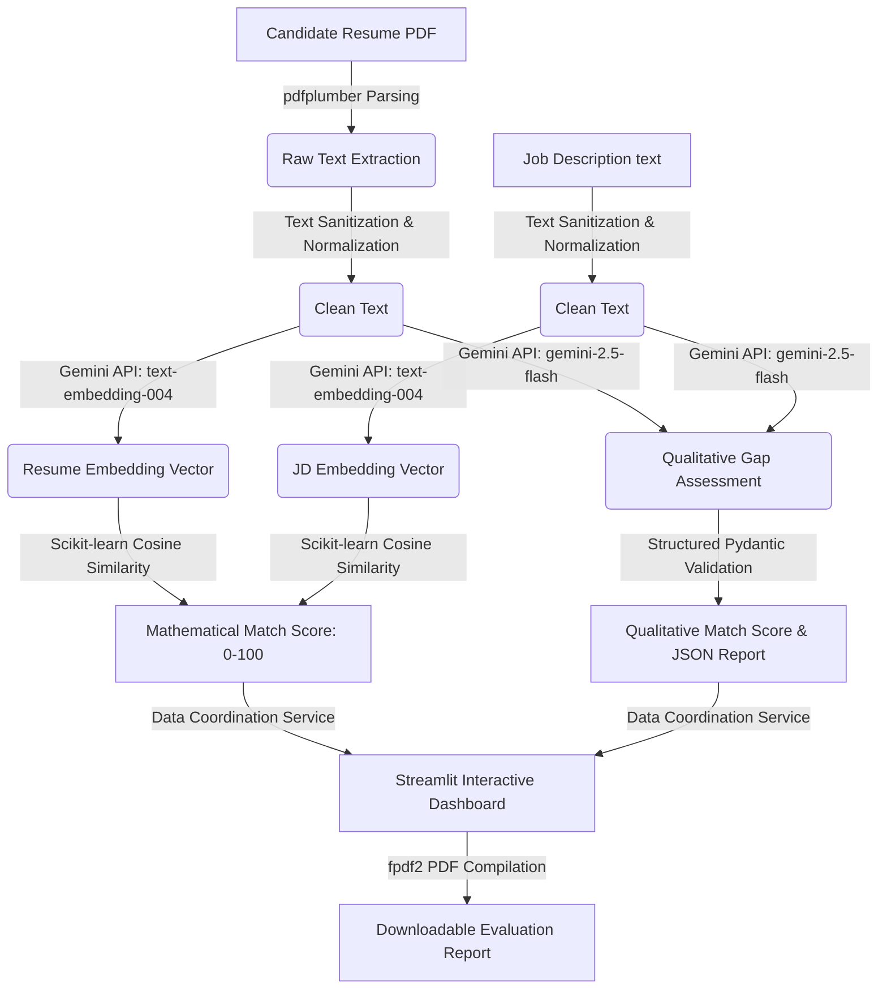

# Semantic Resume Matcher – AI-Powered Resume Analysis System

An enterprise-ready, production-grade AI application designed to intelligently analyze resume PDFs against target job descriptions. Rather than relying on rigid, traditional keyword-matching algorithms, this system leverages modern **Semantic Embeddings** and **Generative AI** to assess a candidate's background, evaluate domain expertise depth, and recommend targeted improvements.

---

## 🚀 Key Features

*   **Semantic Similarity Analysis**: Generates 768-dimensional vector embeddings of the resume and job description using Gemini’s `text-embedding-004` model. Calculates the mathematical cosine similarity (scaled `0–100%`) to assess structural alignment.
*   **Qualitative LLM Evaluation**: Uses Gemini 2.5 Flash (`gemini-2.5-flash`) to perform an intelligent cognitive analysis, returning structured information on qualifications, project impact, and experience fit.
*   **Skills Gap Matrix**: Identifies matched skills and highlights critical missing competencies explicitly requested in the job description but omitted from the resume.
*   **Comprehensive Assessment**: Summarizes key professional strengths and identifies critical experience or technology gaps.
*   **Actionable Rewrite Recommendations**: Provides bulleted, specific resume-improvement suggestions to help candidates optimize formatting, add metrics, or detail projects.
*   **Custom Interview Coaching**: Generates 3–5 tailored technical and behavioral interview questions based on the gaps identified between the candidate's experience and the role.
*   **Targeted Learning Paths**: Recommends specific courses, topics, and industry-standard certifications to bridge identified gaps.
*   **Professional PDF Export**: Compiles all analytics, graphs, and advice into a beautifully styled PDF report generated via `fpdf2` for direct download.
*   **Stunning Streamlit Dashboard**: Crafted with a premium dark-accented UI, HSL-tailored pill badges, progress bars, tabbed guidance sections, and clear metric cards.

---

## 📐 System Architecture & Workflow

The application is built on a modular, decoupled architecture, separating parsing, vector generation, and LLM processing:



### End-to-End Workflow:
1.  **Text Extraction & Sanitization**: The system reads the PDF resume using `pdfplumber` and applies regex-based sanitization in the `text_cleaner` module to strip control characters and optimize layout boundaries while preserving sentence semantics.
2.  **Vector Processing**: The cleaned texts are vectorized using `text-embedding-004`. Because this model represents semantic concepts rather than literal text strings, it captures synonyms (e.g., matching "Deep Learning" with "Neural Networks").
3.  **Similarity Measurement**: Cosine similarity calculates the angular distance between the resume and JD vector representations, outputting a value mapped to `0.0–100.0%`.
4.  **Generative AI Analysis**: The text inputs are evaluated against a specialized system instruction prompt via `gemini-2.5-flash`. The model outputs strict JSON matching a predefined Pydantic schema (`ResumeAnalysisResponse`).
5.  **Dashboard Display**: The Streamlit interface displays mathematical similarity side-by-side with qualitative evaluation metrics, organizing feedback into interactive panels.
6.  **Export Generation**: The report generator builds a multi-page PDF document utilizing color palettes and layout resets to prevent print-boundary collisions.

---

## 🛠️ Project Structure

The project follows clean, industry-standard modular Python design:

```text
semantic-resume-matcher/
├── app.py                      # Main Streamlit dashboard script
├── requirements.txt            # Project library dependencies
├── README.md                   # System documentation and setup guide
├── .env.example                # Sample environment configuration
├── .env                        # Local environment secrets (ignored by Git)
├── assets/                     # Sample data and testing assets
│   ├── sample_job_description.txt
│   ├── sample_resume.pdf       # Compiled sample PDF for testing
│   └── sample_output.json
├── models/
│   ├── __init__.py
│   └── response_models.py      # Pydantic schemas for Gemini JSON enforcement
├── prompts/
│   ├── __init__.py
│   └── prompt.py               # System prompts and templates
├── services/
│   ├── __init__.py
│   ├── analysis_service.py     # Orchestrates end-to-end pipeline execution
│   ├── embedding_service.py    # Generates vectors via Gemini Embeddings
│   ├── gemini_service.py       # Handles structured qualitative reviews
│   └── similarity_service.py   # Computes mathematical cosine similarities
└── utils/
    ├── __init__.py
    ├── helper.py               # JSON parsing & validation utilities
    ├── pdf_parser.py           # Text extraction from uploaded PDFs
    ├── report_generator.py     # Renders professional PDF documents
    └── text_cleaner.py         # Normalizes text spacing & cleanups
```

---

## ⚙️ Installation & Local Setup

### Prerequisites
*   Python 3.12+ (Compatible with Python 3.9+)
*   A Google Gemini API Key from [Google AI Studio](https://aistudio.google.com/)

### Step 1: Clone and Navigate to the Workspace
```bash
git clone https://github.com/yourusername/semantic-resume-matcher.git
cd semantic-resume-matcher
```

### Step 2: Create a Virtual Environment
```bash
python -m venv venv
# On Windows (PowerShell):
.\venv\Scripts\Activate.ps1
# On macOS/Linux:
source venv/bin/activate
```

### Step 3: Install Required Libraries
```bash
pip install -r requirements.txt
```

### Step 4: Configure Environment Variables
Copy the `.env.example` file to `.env` and fill in your Gemini API key:
```bash
cp .env.example .env
```
Inside `.env`:
```env
GEMINI_API_KEY=your_gemini_api_key_here
```

### Step 5: Generate the Sample PDF Resume
Create the pre-packaged resume PDF file to test the match immediately:
```bash
python generate_sample_resume.py
```

### Step 6: Launch the Streamlit Dashboard
```bash
streamlit run app.py
```
Open `http://localhost:8501` in your web browser.

---

## 🌐 Deployment to Streamlit Community Cloud

Deploy your system to Streamlit Community Cloud for public access in a few simple steps:

1.  **Push to GitHub**: Push the repository code (excluding `.env`) to a public GitHub repository.
2.  **Login to Streamlit**: Connect your GitHub account to [Streamlit Share](https://share.streamlit.io/).
3.  **New App Deployment**:
    *   Select your Repository, Branch (`main`), and Main file path (`app.py`).
4.  **Configure Secrets (API Key)**:
    *   In the app configuration page, click on **Advanced Settings**.
    *   Under **Secrets**, paste your API Key using TOML syntax:
        ```toml
        GEMINI_API_KEY = "your_actual_gemini_api_key"
        ```
5.  **Deploy**: Click **Deploy**! Streamlit will install the requirements and launch the live site.

---

## 🧠 System Design & Technical Insights

### 1. Embeddings vs. Traditional Keyword Search
Traditional Applicant Tracking Systems (ATS) scan for exact matches (e.g., checking for "PyTorch" and filtering out resumes that mention "Deep Learning frameworks" or "torch").
This application uses **dense semantic embeddings** (`text-embedding-004`). By converting entire blocks of text into vector representations, it measures mathematical alignment in high-dimensional semantic space. A cosine similarity check calculates the direction of the resume vectors relative to the job requirements, capturing structural relevance:
$$\text{Cosine Similarity} = \frac{\mathbf{A} \cdot \mathbf{B}}{\|\mathbf{A}\| \|\mathbf{B}\|}$$

### 2. Guardrailing Structured JSON Outputs
Large Language Models can occasionally output text descriptions around JSON payloads or write syntactically invalid code blocks. To enforce a structured schema, we:
*   Pass a strict Pydantic model (`ResumeAnalysisResponse`) directly to the Gemini API generation configuration using the `response_schema` parameter.
*   Enforce `response_mime_type="application/json"` to ensure the raw response matches JSON serialization.
*   Implement custom fallback sanitization to strip any accidentally generated markdown block indicators (e.g., ````json ... ````) before validation.

### 3. Resolving Layout Engine Collisions in fpdf2
During developer tests, running consecutive `multi_cell()` rendering inside Python lists resulted in cursor location overflows (`FPDFException: Not enough horizontal space`). In the library's layout logic, a multi-line cell draws lines but fails to reset the horizontal $X$ coordinate to the left margin, causing the next cell to render from the far right edge of the page.
We resolved this layout engine issue by appending explicit `pdf.ln(1)` commands after each item rendering, ensuring that the layout cursor resets cleanly back to the left print boundary.

---

## 🔮 Future Improvements

*   **Batch Resume Comparison**: Enable recruiters to upload a zip folder of resumes and compare them all against a single JD.
*   **Ranked Candidate Scoring**: Sort candidates by their embedding and qualitative similarity scores, showing a structured leaderboard.
*   **LinkedIn Profile Integrator**: Allow users to paste LinkedIn profiles or scrape public endpoints for analysis.
*   **ATS Compatibility Scanner**: Run rules checks to detect if a resume PDF uses double-columns, custom shapes, or image-only scanned text blocks that might break older parsers.
*   **AI Resume Rewrite Copilot**: Provide a side-by-side editing interface where candidates can hit "Auto-Rewrite" to optimize specific sections based on the JD.
*   **GitHub/Portfolio Scanner**: Parse candidate repositories, code quality, commit history, and showcase the findings in the dashboard dashboard.
